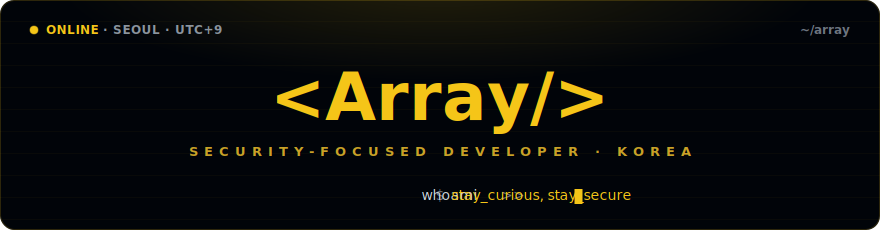
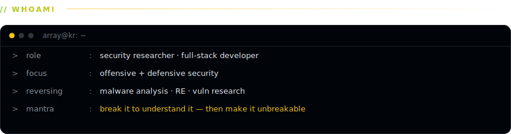
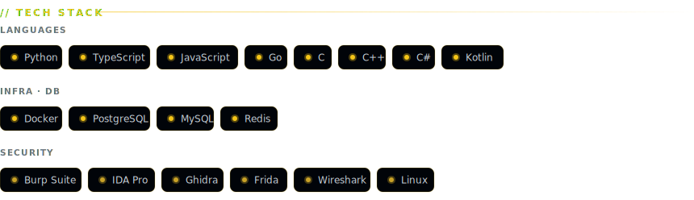
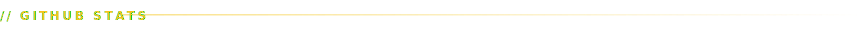
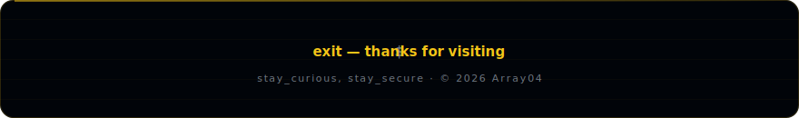

<!--
╔══════════════════════════════════════════════════════════════════════════╗
║  Array04 · GitHub profile README  —  "Terminal Dossier" (preview 1a)       ║
║  theme: gold + black                                                       ║
║                                                                            ║
║  HOW THIS MATCHES THE PREVIEW EXACTLY:                                      ║
║  GitHub strips CSS from README HTML, so the terminal frame / gold chips /   ║
║  whoami card can't be built with markdown. Instead they are baked as        ║
║  custom SVG images in  assets/  — commit that folder next to this file.     ║
║  The live-data widgets (stats, streak, graph, trophies, snake, views) are   ║
║  rendered by their services, themed gold to match.                          ║
║                                                                            ║
║  SETUP                                                                      ║
║  1. Repo must be named  Array04/Array04  (your username, twice).           ║
║  2. Commit this README.md + the whole  assets/  folder.                     ║
║  3. If your handle isn't "Array04", find-and-replace it everywhere below.   ║
║  4. Snake needs a GitHub Action — see the comment near the bottom.          ║
╚══════════════════════════════════════════════════════════════════════════╝
-->

<!-- ===== HEADER BANNER (custom svg) ===== -->

<!-- typing line + live profile views -->

 

 

<!-- ===== WHOAMI (custom svg) ===== -->

 

<!-- ===== TECH STACK (custom svg) ===== -->

 

<!-- ===== GITHUB STATS ===== -->

 

  

 

<!-- ===== CONTRIBUTION GRAPH (잔디) ===== -->

  

<!--
  ===== CONTRIBUTION SNAKE =====
  Needs a GitHub Action. Add .github/workflows/snake.yml using Platane/snk,
  schedule it, and push the SVG to the `output` branch. Keep it gold:
      color_snake: '#F5C518'
      color_dots:  '#161b22,#8C6D1F,#C9A227,#E0B21F,#F5C518'
  Until the action runs once, this image 404s — that's expected.
-->

 

<!-- ===== FOOTER (custom svg) ===== -->

